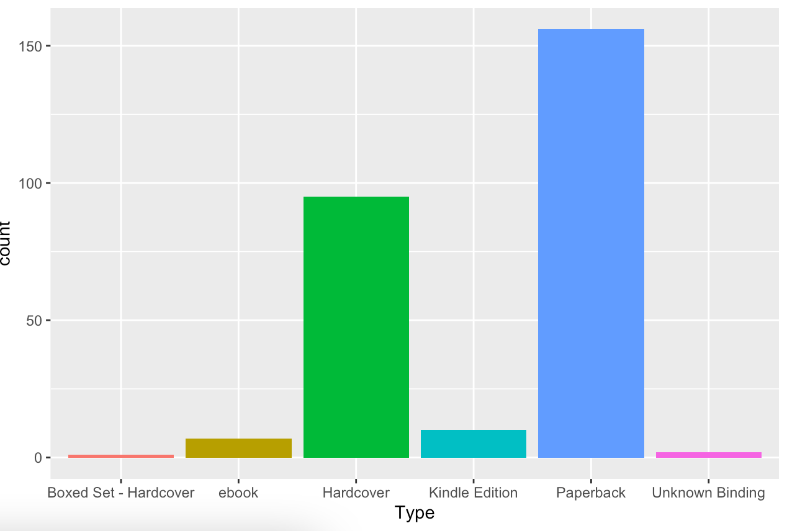
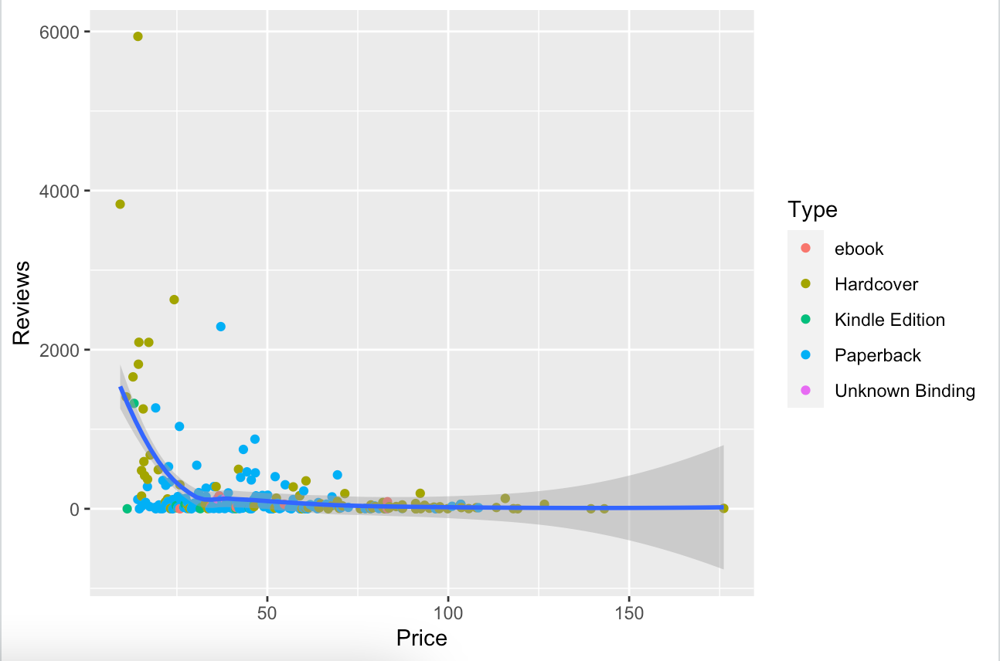

# R-Assignment 4

**Created by Siriwat Jaiyungyuen (ID: 63130500120)**

Choose Dataset:
1. Top 270 Computer Science / Programing Books (Data from Thomas Konstantin, [Kaggle](https://www.kaggle.com/thomaskonstantin/top-270-rated-computer-science-programing-books)) >> [Using CSV](https://raw.githubusercontent.com/safesit23/INT214-Statistics/main/datasets/prog_book.csv)

### Outlines
#### Part A

1. [Explore the dataset](#explore-the-dataset)
2. [Learning function from Tidyverse](#learning-function-from-tidyverse)
3. [Transform data with dplyr and finding insight the data](#transform-data-with-dplyr-and-finding-insight-the-data)
4. [Visualization with GGplot2](#visualization-with-ggplot2)

#### Part B
5. [Visualization with PowerBI](#visualization-with-powerbi)
## Explore the dataset

```R
#install lib
install.packages("dplyr")
install.packages("readr")
install.packages("stringr")
install.packages("assertive")
install.packages("ggplot2")

#load lib
library(dplyr)
library(readr)
library(stringr)
library(assertive)
library(ggplot2)

#import datasets
top_cs <- read_csv("https://raw.githubusercontent.com/safesit23/INT214-Statistics/main/datasets/prog_book.csv")

#Explore dataset
glimpse(top_cs)
```

ใน dataset นี้มีข้อมูลดังนี้

```
หลังจาก read_csv
Rows: 271 Columns: 7                                                                              
── Column specification ────────────────────────────────────────────────────────────────────────────
Delimiter: ","
chr (3): Book_title, Description, Type
dbl (3): Rating, Number_Of_Pages, Price
```

```
หลังจาก glimpse
Rows: 271
Columns: 7
$ Rating          <dbl> 4.17, 4.01, 3.33, 3.97, 4.06, 3.84, 4.09, 4.15, 3.87, 4.62, 4.03, 3.78, 3.…
$ Reviews         <dbl> 3829, 1406, 0, 1658, 1325, 117, 5938, 1817, 2093, 0, 160, 481, 33, 1255, 5…
$ Book_title      <chr> "The Elements of Style", "The Information: A History, a Theory, a Flood", …
$ Description     <chr> "This style manual offers practical advice on improving writing skills. Th…
$ Number_Of_Pages <dbl> 105, 527, 50, 393, 305, 288, 256, 368, 259, 128, 352, 352, 200, 328, 240, …
$ Type            <chr> "Hardcover", "Hardcover", "Kindle Edition", "Hardcover", "Kindle Edition",…
$ Price           <dbl> 9.323529, 11.000000, 11.267647, 12.873529, 13.164706, 14.188235, 14.232353…

```

คำอธิบายแต่ละ column

|Column|Describe|
|-|-|
|Rating|ค่าคะแนนเรตติ้งของหนังสือ|
|Reviews|จำนวนการรีวิวของหนังสือ|
|Book_title|ชื่อหนังสือ|
|Description|คำอธิบายเกี่ยวกับหนังสือ|
|Number_Of_Pages|จำนวนหน้าของหนังสือ|
|Type|ประเภทหนังสือ|
|Price|ราคาของหนังสือ|

## Learning function from Tidyverse

- Function `select()` from package [dplyr](https://dplyr.tidyverse.org/articles/dplyr.html#select-columns-with-select). It using for select columns
- Function `slice()` from package [dplyr](https://dplyr.tidyverse.org/articles/base.html). It using for slice columns that you choose.
- Function `filter()` from package [dplyr](https://dplyr.tidyverse.org/articles/base.html). Return rows with matching conditions
- Function `relocate()` from package [dplyr](https://dplyr.tidyverse.org/articles/base.html). It using for locate column the you want into front
- Function `arrange()` rom package [dplyr](https://dplyr.tidyverse.org/articles/base.html). orders the rows of a data frame by the values of selected columns.

#### 1.แสดงชื่อหนังสือและเรทติ้งของหนังสือที่มีเรตติ้งมากที่สุดในหมวดหมู่ Hardcover

##### Code

```R
top_cs %>%
  filter(Type == 'Hardcover') %>%
  filter(Rating == max(Rating)) %>%
  select(Book_title,Rating)
```

##### Result

```R
# A tibble: 1 × 2
  Book_title                                              Rating
  <chr>                                                    <dbl>
1 The Art of Computer Programming, Volumes 1-4a Boxed Set   4.77
```

#### 2. ชื่อหนังสือ 10 อันดับแรกใน dataset

##### Code

```R
top_cs %>% 
  slice(1:10) %>%
  select(Book_title)
```

##### Result

```
# A tibble: 10 × 1
   Book_title                                                                            
   <chr>                                                                                 
 1 The Elements of Style                                                                 
 2 The Information: A History, a Theory, a Flood                                         
 3 Responsive Web Design Overview For Beginners                                          
 4 Ghost in the Wires: My Adventures as the World's Most Wanted Hacker                   
 5 How Google Works                                                                      
 6 The Meme Machine                                                                      
 7 Start with Why: How Great Leaders Inspire Everyone to Take Action                     
 8 Algorithms to Live By: The Computer Science of Human Decisions                        
 9 Weapons of Math Destruction: How Big Data Increases Inequality and Threatens Democracy
10 ZX Spectrum Games Code Club: Twenty fun games to code and learn  
```

#### 3.เพิ่ม column ข้อมูล Rating/Review

##### Code

```R
top_cs %>%
  mutate(Rating/Reviews)
```

##### Result

```
# A tibble: 271 × 8
   Rating Reviews Book_title        Description         Number_Of_Pages Type  Price `Rating/Reviews`
    <dbl>   <dbl> <chr>             <chr>                         <dbl> <chr> <dbl>            <dbl>
 1   4.17    3829 The Elements of … "This style manual…             105 Hard…  9.32         0.00109 
 2   4.01    1406 The Information:… "James Gleick, the…             527 Hard… 11            0.00285 
 3   3.33       0 Responsive Web D… "In Responsive Web…              50 Kind… 11.3        Inf       
 4   3.97    1658 Ghost in the Wir… "If they were a ha…             393 Hard… 12.9          0.00239 
 5   4.06    1325 How Google Works  "Both Eric Schmidt…             305 Kind… 13.2          0.00306 
 6   3.84     117 The Meme Machine  "What is a meme? F…             288 Pape… 14.2          0.0328  
 7   4.09    5938 Start with Why: … "Why do you do wha…             256 Hard… 14.2          0.000689
 8   4.15    1817 Algorithms to Li… "A fascinating exp…             368 Hard… 14.4          0.00228 
 9   3.87    2093 Weapons of Math … "A former Wall Str…             259 Hard… 14.5          0.00185 
10   4.62       0 ZX Spectrum Game… "This book is idea…             128 Pape… 14.6        Inf       
# … with 261 more rows
```

#### 4.แสดงข้อมูลหนังสือตามลำดับราคาจากน้อยไปมาก 5 รายการแรก

##### Code

```R
top_cs %>% 
  arrange(Price) %>%
  slice(1:5)
```

##### Result

```
# A tibble: 5 × 7
  Rating Reviews Book_title              Description                    Number_Of_Pages Type   Price
   <dbl>   <dbl> <chr>                   <chr>                                    <dbl> <chr>  <dbl>
1   4.17    3829 The Elements of Style   "This style manual offers pra…             105 Hardc…  9.32
2   4.01    1406 The Information: A His… "James Gleick, the author of …             527 Hardc… 11   
3   3.33       0 Responsive Web Design … "In Responsive Web Design Ove…              50 Kindl… 11.3 
4   3.97    1658 Ghost in the Wires: My… "If they were a hall of fame …             393 Hardc… 12.9 
5   4.06    1325 How Google Works        "Both Eric Schmidt and Jonath…             305 Kindl… 13.2 
```

#### 5.แสดง column Book_Title เป็น column แรก

##### Code

```R
top_cs %>% relocate(Book_title)
```

##### Result

```
# A tibble: 271 × 7
   Book_title                Rating Reviews Description                 Number_Of_Pages Type   Price
   <chr>                      <dbl>   <dbl> <chr>                                 <dbl> <chr>  <dbl>
 1 The Elements of Style       4.17    3829 "This style manual offers …             105 Hardc…  9.32
 2 The Information: A Histo…   4.01    1406 "James Gleick, the author …             527 Hardc… 11   
 3 Responsive Web Design Ov…   3.33       0 "In Responsive Web Design …              50 Kindl… 11.3 
 4 Ghost in the Wires: My A…   3.97    1658 "If they were a hall of fa…             393 Hardc… 12.9 
 5 How Google Works            4.06    1325 "Both Eric Schmidt and Jon…             305 Kindl… 13.2 
 6 The Meme Machine            3.84     117 "What is a meme? First coi…             288 Paper… 14.2 
 7 Start with Why: How Grea…   4.09    5938 "Why do you do what you do…             256 Hardc… 14.2 
 8 Algorithms to Live By: T…   4.15    1817 "A fascinating exploration…             368 Hardc… 14.4 
 9 Weapons of Math Destruct…   3.87    2093 "A former Wall Street quan…             259 Hardc… 14.5 
10 ZX Spectrum Games Code C…   4.62       0 "This book is ideal for ZX…             128 Paper… 14.6 
# … with 261 more rows
```


## Transform data with dplyr and finding insight the data

#### 1. หาข้อมูลหนังสือที่มี Rating มากกว่า Rating น้อยที่สุด และมีคะแนนรีวิว มากกว่า 200 และเป็นประเภท Hardcover

```R
top_cs %>% filter(Rating>min(Rating)) %>%
  filter(Reviews>200) %>% filter(Type=="Hardcover")
```

Result:

```
# A tibble: 20 × 7
   Rating Reviews Book_title                 Description                 Number_Of_Pages Type  Price
    <dbl>   <dbl> <chr>                      <chr>                                 <dbl> <chr> <dbl>
 1   4.17    3829 The Elements of Style      "This style manual offers …             105 Hard…  9.32
 2   4.01    1406 The Information: A Histor… "James Gleick, the author …             527 Hard… 11   
 3   3.97    1658 Ghost in the Wires: My Ad… "If they were a hall of fa…             393 Hard… 12.9 
 4   4.09    5938 Start with Why: How Great… "Why do you do what you do…             256 Hard… 14.2 
 5   4.15    1817 Algorithms to Live By: Th… "A fascinating exploration…             368 Hard… 14.4 
 6   3.87    2093 Weapons of Math Destructi… "A former Wall Street quan…             259 Hard… 14.5 
 7   3.78     481 The Master Algorithm: How… "A thought-provoking and w…             352 Hard… 15.2 
 8   3.87    1255 Superintelligence: Paths,… "Superintelligence asks th…             328 Hard… 15.7 
 9   3.87     593 The Art of the Start: The… "A new product, a new serv…             240 Hard… 15.9 
10   3.95     417 Kingpin: How One Hacker T… "The true story of Max But…             288 Hard… 16.1 
11   3.75     370 Our Final Invention: Arti… "In as little as a decade,…             336 Hard… 16.9 
12   4.1     2092 The Innovators: How a Gro… "The computer and the inte…             542 Hard… 17.2 
13   3.71     676 Big Data: A Revolution Th… "A revelatory exploration …             242 Hard… 17.6 
14   3.97     491 How to Create a Mind: The… "The bold futurist and bes…             336 Hard… 19.9 
15   4.27    2629 The Phoenix Project: A No… "Bill is an IT manager at …             345 Hard… 24.3 
16   4.06     302 The Strangest Man: The Hi… "'A monumental achievement…             539 Hard… 25.8 
17   3.83     278 Automate This: How Algori… "The rousing story of the …             256 Hard… 35.8 
18   4.4      496 The Visual Display of Qua… "The classic book on stati…             197 Hard… 42.0 
19   4.25     275 Refactoring: Improving th… "As the application of obj…             431 Hard… 57.2 
20   4.18     351 Design Patterns: Elements… "Capturing a wealth of exp…             416 Hard… 60.7 
```

#### 2. แสดงชื่อหนังสือ เรทติ้ง และราคา ของหนังสือที่มีเรทติ้งน้อยกว่า 4.5 โดยแสดงหนังสือที่มีราคาน้อยที่สุดที่ตรงตามเงื่อนไข

```R
top_cs %>% select(Book_title, Rating, Price) %>%
  filter(Rating < 4.5) %>% slice_min(Price)
```

Result:

```
# A tibble: 1 × 3
  Book_title            Rating Price
  <chr>                  <dbl> <dbl>
1 The Elements of Style   4.17  9.32
```

## Visualization with GGplot2

### 1.) แสดงจำนวนหนังสือแต่ละประเภท

```R
ggplot(top_cs,aes(x=Type,fill=Type)) + geom_bar() +
  scale_fill_hue(c = 100,200,30) 
```

Result:



### 2.) แสดงความสัมพันธ์ระหว่างจำนวนรีวิวกับราคา

```R
scat_plot <- top_cs %>% filter(Price<180) %>% ggplot(aes(x=Price,y=Reviews))+
  geom_point(aes(color=Type))
scat_plot+geom_smooth()
```

Result:



## Visualization with PowerBI

เราใช้เครื่องมือ powerBI ในการทำ Visualization
[Click Here](https://app.powerbi.com/view?r=eyJrIjoiYzM3NDkwNTMtNjE5NS00MDdkLWE1NTEtNjY5Y2VhZjBjOWVhIiwidCI6IjZmNDQzMmRjLTIwZDItNDQxZC1iMWRiLWFjMzM4MGJhNjMzZCIsImMiOjEwfQ%3D%3D&pageName=ReportSection)