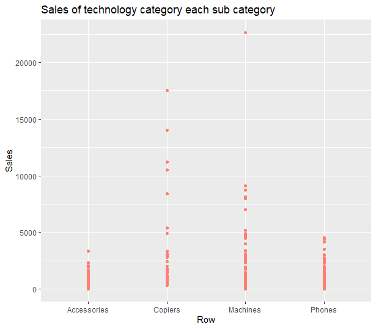
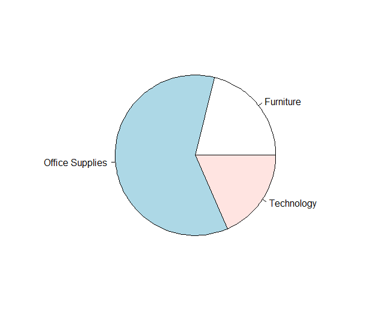

# R-Assignment 4

**Created by Asamaporn Pladsri (ID: 63130500135)**

Choose Dataset:

Superstore Sales Dataset (Data from Rohit Sahoo, [Kaggle](https://www.kaggle.com/rohitsahoo/sales-forecasting)) >> [Using CSV](https://raw.githubusercontent.com/safesit23/INT214-Statistics/main/datasets/superstore_sales.csv)


### Outlines
1. [Explore the dataset](#Part-1:-Explore-the-dataset)
2. [Learning function from Tidyverse](#Part-2:-Learning-function-from-Tidyverse)
3. [Transform data with dplyr and finding insight the data](#Part-3:-Transform-data-with-dplyr-and-finding-insight-the-data)
4. [Visualization with GGplot2](#Part-4:-Visualization-with-GGplot2)

## Part 1: Explore the dataset

Install package and loading package

```R
#Explore the dataset
#Install Package
install.packages("dplyr")
install.packages("DescTools")

#Loading package
library(dplyr)
library(DescTools)
```

Load data from rawgithub

```R
#Load data
storesales <- read.csv("https://raw.githubusercontent.com/safesit23/INT214-Statistics/main/datasets/superstore_sales.csv")
```

In this dataset has 9,800 rows, 18 columns that show retail dataset of a global superstore for 4 years.

Explore data

```R
#Explore data
View(storesales)
#or
glimpse(storesales)
```

Result

```
Rows: 9,800
Columns: 18
$ Row.ID        <int> 1, 2, 3, 4, 5, 6, 7, 8, 9, 10, 11~
$ Order.ID      <chr> "CA-2017-152156", "CA-2017-152156~
$ Order.Date    <chr> "08/11/2017", "08/11/2017", "12/0~
$ Ship.Date     <chr> "11/11/2017", "11/11/2017", "16/0~
$ Ship.Mode     <chr> "Second Class", "Second Class", "~
$ Customer.ID   <chr> "CG-12520", "CG-12520", "DV-13045~
$ Customer.Name <chr> "Claire Gute", "Claire Gute", "Da~
$ Segment       <chr> "Consumer", "Consumer", "Corporat~
$ Country       <chr> "United States", "United States",~
$ City          <chr> "Henderson", "Henderson", "Los An~
$ State         <chr> "Kentucky", "Kentucky", "Californ~
$ Postal.Code   <int> 42420, 42420, 90036, 33311, 33311~
$ Region        <chr> "South", "South", "West", "South"~
$ Product.ID    <chr> "FUR-BO-10001798", "FUR-CH-100004~
$ Category      <chr> "Furniture", "Furniture", "Office~
$ Sub.Category  <chr> "Bookcases", "Chairs", "Labels", ~
$ Product.Name  <chr> "Bush Somerset Collection Bookcas~
$ Sales         <dbl> 261.9600, 731.9400, 14.6200, 957.~
```

Cleaning data
```R
#Cleaning data
#Rename
sales <- storesales
sales <- sales %>% rename(Row = Row.ID)
sales <- sales %>% rename(ProductName = Product.Name)

#Changing types of values
sales$Row <- as.character(sales$Row)
sales$Postal.Code <- as.character(sales$Postal.Code)

#Show result cleaned data
glimpse(sales)
```

Result

```
Rows: 9,800
Columns: 18
$ Row           <chr> "1", "2", "3", "4", "5", "6", "7"~
$ Order.ID      <chr> "CA-2017-152156", "CA-2017-152156~
$ Order.Date    <chr> "08/11/2017", "08/11/2017", "12/0~
$ Ship.Date     <chr> "11/11/2017", "11/11/2017", "16/0~
$ Ship.Mode     <chr> "Second Class", "Second Class", "~
$ Customer.ID   <chr> "CG-12520", "CG-12520", "DV-13045~
$ Customer.Name <chr> "Claire Gute", "Claire Gute", "Da~
$ Segment       <chr> "Consumer", "Consumer", "Corporat~
$ Country       <chr> "United States", "United States",~
$ City          <chr> "Henderson", "Henderson", "Los An~
$ State         <chr> "Kentucky", "Kentucky", "Californ~
$ Postal.Code   <chr> "42420", "42420", "90036", "33311~
$ Region        <chr> "South", "South", "West", "South"~
$ Product.ID    <chr> "FUR-BO-10001798", "FUR-CH-100004~
$ Category      <chr> "Furniture", "Furniture", "Office~
$ Sub.Category  <chr> "Bookcases", "Chairs", "Labels", ~
$ ProductName   <chr> "Bush Somerset Collection Bookcas~
$ Sales         <dbl> 261.9600, 731.9400, 14.6200, 957.~
```

Explain

```
Row.ID -> Row
Product.Name -> ProductName

Row <int> -> Row <chr>
Postal.Code <int> -> Postal.Code <chr>
```
Change type Integer to Character because it's not necessary to calculate.

## Part 2: Learning function from Tidyverse

Install package and loading package

```R
#Install Package
install.packages("tidyverse")

#Loading package
library(tidyverse)
```

- Function `summarize_if()` from package [dplyr](https://dplyr.tidyverse.org/reference/summarise.html). It using for summarize the whole data with condition.

```R
#Summarize mean of all columns that are numeric
sales %>% summarize_if(is.numeric,mean)
#Summarize max of all columns that are numeric
sales %>% summarize_if(is.numeric,max)
#Summarize min of all columns that are numeric
sales %>% summarize_if(is.numeric,min)
```

Result

```
> sales %>% summarize_if(is.numeric,mean)
     Sales
1 230.7691

> sales %>% summarize_if(is.numeric,max)
     Sales
1 22638.48

> sales %>% summarize_if(is.numeric,min)
  Sales
1 0.444
```

- Function `as_tibble()` from package [tidyr](https://tibble.tidyverse.org/reference/as_tibble.html). It using for the data frame that is designed for presentation.

```R
as_tibble(sales)
```

Result

```
# A tibble: 9,800 x 18
   Row   Order.ID       Order.Date Ship.Date  Ship.Mode  
   <chr> <chr>          <chr>      <chr>      <chr>      
 1 1     CA-2017-152156 08/11/2017 11/11/2017 Second Cla~
 2 2     CA-2017-152156 08/11/2017 11/11/2017 Second Cla~
 3 3     CA-2017-138688 12/06/2017 16/06/2017 Second Cla~
 4 4     US-2016-108966 11/10/2016 18/10/2016 Standard C~
 5 5     US-2016-108966 11/10/2016 18/10/2016 Standard C~
 6 6     CA-2015-115812 09/06/2015 14/06/2015 Standard C~
 7 7     CA-2015-115812 09/06/2015 14/06/2015 Standard C~
 8 8     CA-2015-115812 09/06/2015 14/06/2015 Standard C~
 9 9     CA-2015-115812 09/06/2015 14/06/2015 Standard C~
10 10    CA-2015-115812 09/06/2015 14/06/2015 Standard C~
# ... with 9,790 more rows, and 13 more variables:
#   Customer.ID <chr>, Customer.Name <chr>,
#   Segment <chr>, Country <chr>, City <chr>,
#   State <chr>, Postal.Code <chr>, Region <chr>,
#   Product.ID <chr>, Category <chr>,
#   Sub.Category <chr>, ProductName <chr>, Sales <dbl>
```

- Function `pivot_longer()` from package [tidyr](https://tidyr.tidyverse.org/reference/pivot_longer.html). It using for change data in to a long form.

```R
descsales <- sales %>% pivot_longer(cols = Product.ID:ProductName, names_to = "description", values_to = "value")
#View the data in the long form
glimpse(descsales)
```

Result

```
Rows: 39,200
Columns: 16
$ Row           <chr> "1", "1", "1", "1", "2", "2", "2"~
$ Order.ID      <chr> "CA-2017-152156", "CA-2017-152156~
$ Order.Date    <chr> "08/11/2017", "08/11/2017", "08/1~
$ Ship.Date     <chr> "11/11/2017", "11/11/2017", "11/1~
$ Ship.Mode     <chr> "Second Class", "Second Class", "~
$ Customer.ID   <chr> "CG-12520", "CG-12520", "CG-12520~
$ Customer.Name <chr> "Claire Gute", "Claire Gute", "Cl~
$ Segment       <chr> "Consumer", "Consumer", "Consumer~
$ Country       <chr> "United States", "United States",~
$ City          <chr> "Henderson", "Henderson", "Hender~
$ State         <chr> "Kentucky", "Kentucky", "Kentucky~
$ Postal.Code   <chr> "42420", "42420", "42420", "42420~
$ Region        <chr> "South", "South", "South", "South~
$ Sales         <dbl> 261.9600, 261.9600, 261.9600, 261~
$ description   <chr> "Product.ID", "Category", "Sub.Ca~
$ value         <chr> "FUR-BO-10001798", "Furniture", "~
```

- Function `pivot_wider()` from package [tidyr](https://tidyr.tidyverse.org/reference/pivot_wider.html). It using for convert data back to the wide form.

```R
descsales <- descsales %>% pivot_wider(names_from = "description", values_from = "value")
#View the data in the wide form
glimpse(descsales)
```

Result

```
Rows: 9,800
Columns: 18
$ Row           <chr> "1", "2", "3", "4", "5", "6", "7"~
$ Order.ID      <chr> "CA-2017-152156", "CA-2017-152156~
$ Order.Date    <chr> "08/11/2017", "08/11/2017", "12/0~
$ Ship.Date     <chr> "11/11/2017", "11/11/2017", "16/0~
$ Ship.Mode     <chr> "Second Class", "Second Class", "~
$ Customer.ID   <chr> "CG-12520", "CG-12520", "DV-13045~
$ Customer.Name <chr> "Claire Gute", "Claire Gute", "Da~
$ Segment       <chr> "Consumer", "Consumer", "Corporat~
$ Country       <chr> "United States", "United States",~
$ City          <chr> "Henderson", "Henderson", "Los An~
$ State         <chr> "Kentucky", "Kentucky", "Californ~
$ Postal.Code   <chr> "42420", "42420", "90036", "33311~
$ Region        <chr> "South", "South", "West", "South"~
$ Sales         <dbl> 261.9600, 731.9400, 14.6200, 957.~
$ Product.ID    <chr> "FUR-BO-10001798", "FUR-CH-100004~
$ Category      <chr> "Furniture", "Furniture", "Office~
$ Sub.Category  <chr> "Bookcases", "Chairs", "Labels", ~
$ ProductName   <chr> "Bush Somerset Collection Bookcas~
```

## Part 3: Transform data with dplyr and finding insight the data

### 1. What is the highest price in each category?

```R
sales %>% group_by(Category) %>% summarize(max_price = max(Sales))
```

Result:

```
# A tibble: 3 x 2
  Category        max_price
  <chr>               <dbl>
1 Furniture           4416.
2 Office Supplies     9893.
3 Technology         22638.
```

Explain

- Use group_by() function to group Category.
- Use Summarize() function to find the max Sales in each Category.

### 2. What is the total sales amount?

```R
sales %>% summarise(sumsales = sum(Sales))
```

Result:

```
  sumsales
1  2261537
```

Explain

- Use summarize() function to find the sum of all Sales.

### 3. Find the city that bought the chairs.

```R
sales %>% filter(Sub.Category == "Chairs") %>% distinct(City)
```

Result:

```
                City
1          Henderson
2       Philadelphia
3            Houston
4         New Albany
5               Troy
6            Chicago
7            Memphis
8           Columbia
9        Los Angeles
10          Franklin
.
(more 180 rows)
```

Explain

- Use filter() function to filter sub category only "chairs".
- Use distinct() function to show the city that bought the chairs.

### 4. Find the product name that ordered in 08/08/2017

```R
sales %>% filter(Order.Date == "08/08/2017") %>% select(ProductName)
```

Result:

```
                                                   ProductName
1                             OIC Bulk Pack Metal Binder Clips
2   Ink Jet Note and Greeting Cards, 8-1/2" x 5-1/2" Card Size
3                    Alliance Super-Size Bands, Assorted Sizes
4         Chromcraft 48" x 96" Racetrack Double Pedestal Table
5 Kensington 4 Outlet MasterPiece Compact Power Control Center
6                                    Acco Hanging Data Binders
7                                                   Xerox 1954
```

Explain

- Use filter() function to filter the order date to "08/08/2017"
- Use select() function to show the product name that order in this date.

### 5. What state is the most ordering?

```R
Mode(sales$State)
```

Result:

```
[1] "California"
attr(,"freq")
[1] 1946
```

Explain

- Use Mode() function to find the state that have the most ordering.

### 6. Show 10 ranks of customer names that have the most purchase.

```R
sales %>% select(Customer.Name, ProductName, Category, Sales) %>% slice_max(Sales, n=10)
```

Result:

```
        Customer.Name                                               ProductName        Category     Sales
1         Sean Miller     Cisco TelePresence System EX90 Videoconferencing Unit      Technology 22638.480
2        Tamara Chand                     Canon imageCLASS 2200 Advanced Copier      Technology 17499.950
3        Raymond Buch                     Canon imageCLASS 2200 Advanced Copier      Technology 13999.960
4        Tom Ashbrook                     Canon imageCLASS 2200 Advanced Copier      Technology 11199.968
5        Hunter Lopez                     Canon imageCLASS 2200 Advanced Copier      Technology 10499.970
6       Adrian Barton          GBC Ibimaster 500 Manual ProClick Binding System Office Supplies  9892.740
7        Sanjit Chand                      Ibico EPK-21 Electric Binding System Office Supplies  9449.950
8        Bill Shonely          3D Systems Cube Printer, 2nd Generation, Magenta      Technology  9099.930
9        Sanjit Engle HP Designjet T520 Inkjet Large Format Printer - 24" Color      Technology  8749.950
10 Christopher Conant                     Canon imageCLASS 2200 Advanced Copier      Technology  8399.976
```

Explain

- Use select() function to show only customer name, product name, category, sales.
- Use slice_max() function to show the max of sales and show 10 column.

### 7. Find the product name that in furniture category and have sales more than 3000

```R
sales %>% select(ProductName, Category, Sales) %>% filter(Category == "Furniture" & Sales > 3000)
```

Result:

```
                                                     ProductName  Category    Sales
1  Riverside Palais Royal Lawyers Bookcase, Royale Cherry Finish Furniture 3083.430
2                     Bretford Rectangular Conference Table Tops Furniture 3610.848
3                   HON 5400 Series Task Chairs for Big and Tall Furniture 3504.900
4  Riverside Palais Royal Lawyers Bookcase, Royale Cherry Finish Furniture 4228.704
5                          DMI Eclipse Executive Suite Bookcases Furniture 4007.840
6                   HON 5400 Series Task Chairs for Big and Tall Furniture 4416.174
7                   HON 5400 Series Task Chairs for Big and Tall Furniture 3785.292
8       Chromcraft Bull-Nose Wood Oval Conference Tables & Bases Furniture 4297.644
9                          DMI Eclipse Executive Suite Bookcases Furniture 3406.664
10 Riverside Palais Royal Lawyers Bookcase, Royale Cherry Finish Furniture 4404.900
```

Explain

- Use select() function to show only product name, category, sales
- Use filter() function to filter Category only "Furniture" and sales more than 3000

## Part 4: Visualization with GGplot2

### 1. Graph show sales of technology category each sub category.

```R
plot1 <- sales %>% filter(sales$Category == "Technology") %>% ggplot(aes(x = Row, y= Sales)) + geom_point(aes(Sub.Category), color = "#ff8070") + ggtitle("Sales of technology category each sub category")

plot1
```

Result:



### 2. Show the pie chart that show the most sold categories products.

```R
x <- sales %>% count(Category) %>% filter(n >= 0) %>% select(n)
price <- as.double(unlist(x))
cate <- sales %>% count(Category) %>% select(-n)
cat <- as.character(unlist(cateandsub))

piechart <- pie(price, cat)
```

Result:


