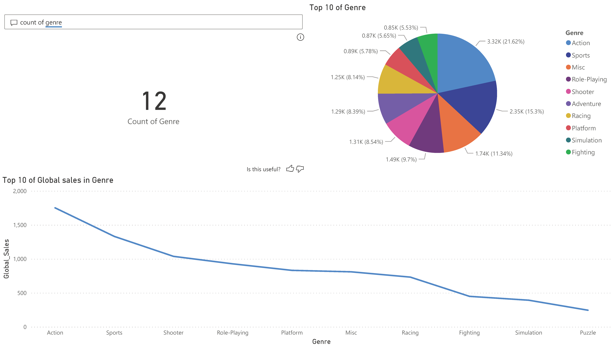
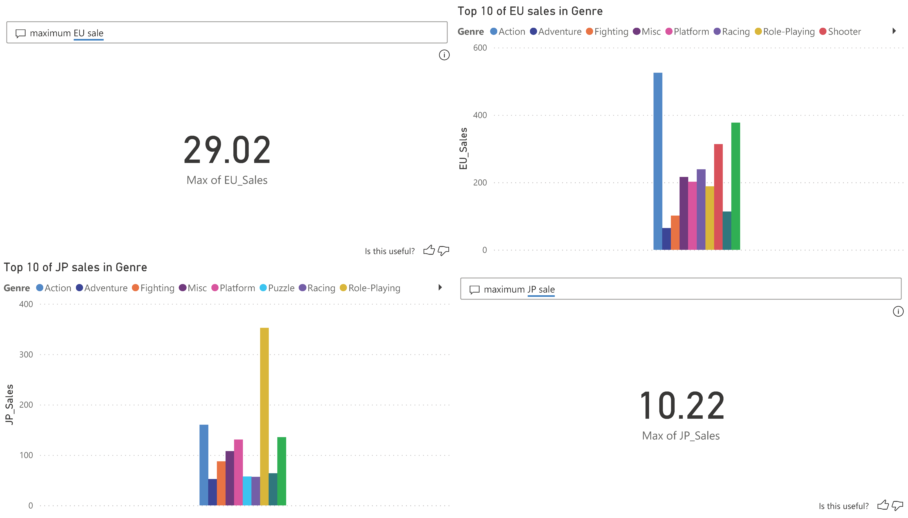
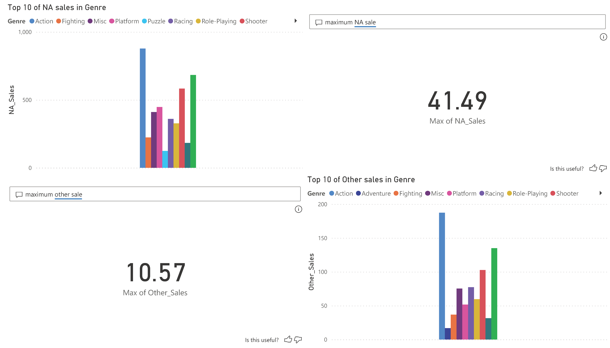
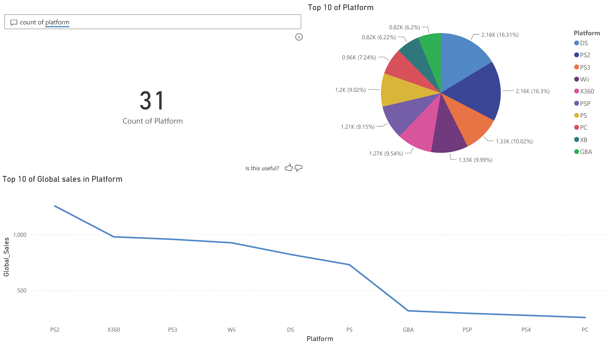
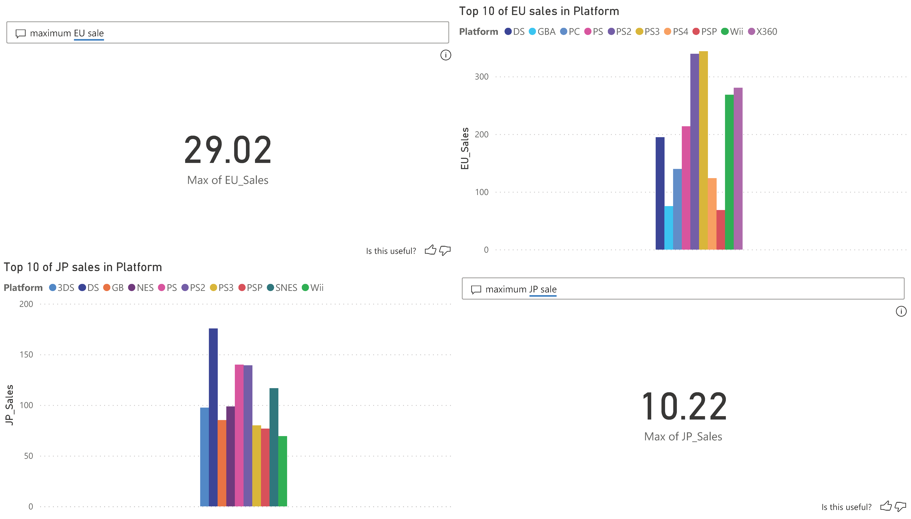
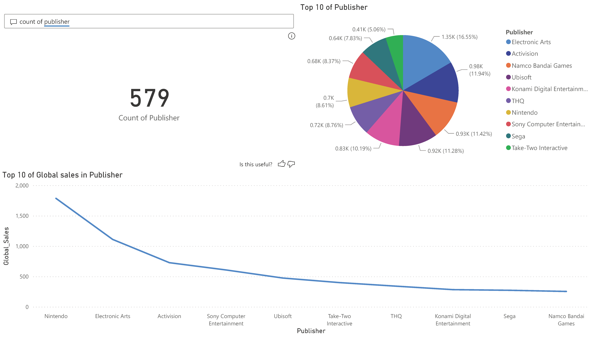
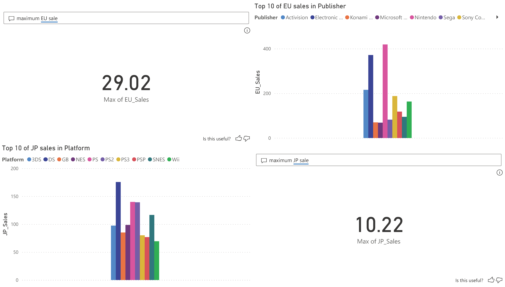
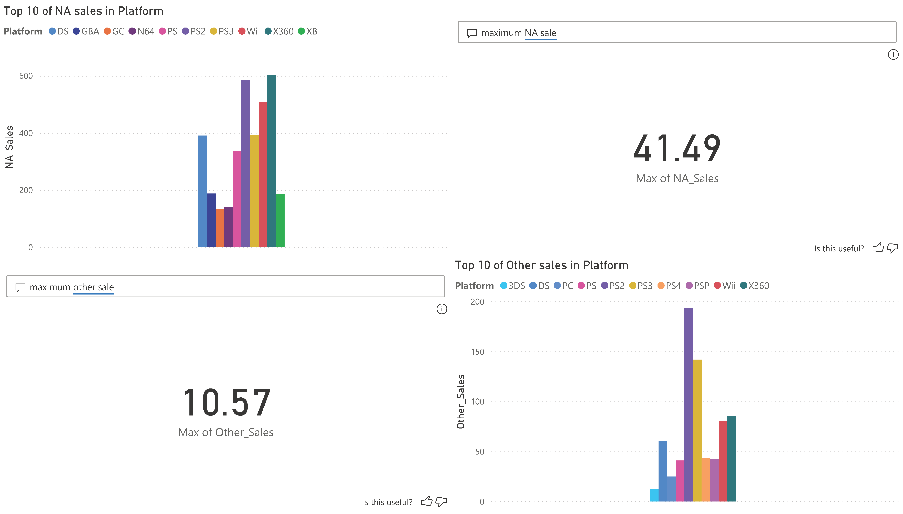
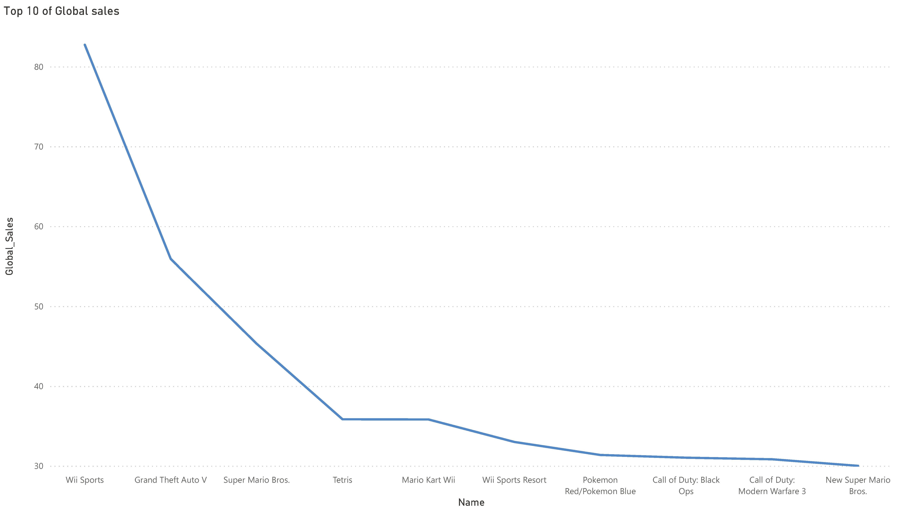

# Data Visualization with Power BI

Power BI : [LINK](https://app.powerbi.com/view?r=eyJrIjoiZDdkMjlkZWUtNGY3MS00MTFmLWI4YWEtYjA1ZWU0YWY5ZGMyIiwidCI6IjZmNDQzMmRjLTIwZDItNDQxZC1iMWRiLWFjMzM4MGJhNjMzZCIsImMiOjEwfQ%3D%3D)



```txt
Top 10 of Genre
Action game is the most genre with the highest number of games.

Top 10 of Global Sales in Genre
Action game is the best sales game in global.

Genre of the Games
The games have 12 genre.
```

---


```txt
Top 10 of Europe Sales in Genre
Action game is the best sales game in Europe.

Top 10 of Japan Sales in Genre
Role-Playing game is the best sales game in Japan.

Maximum of Europe Sales
29.02 millions.

Maximum of Japan Sales
29.02 millions.
```

---



```txt
Top 10 of North America Sales in Genre
Action game is the best sales game in North America.

Top 10 of Other Sales in Genre
Action game is the best sales game in Other.

Maximum of North America Sales
41.49 millions.

Maximum of Other Sales
10.57 millions.
```

---



```txt
Top 10 of Platform
DS is the most platform with the highest number of games.

Top 10 of Global Sales in Platform
PS2 is the best sales platform in global.

Platform of the Games
The games have 31 platform.
```

---



```txt
Top 10 of Europe Sales in Platform
PS3 is the best sales platform in Europe.

Top 10 of Japan Sales in Platform
DS is the best sales platform in Japan.

Maximum of Europe Sales
29.02 millions.

Maximum of Japan Sales
29.02 millions.
```

---


```txt
Top 10 of North America Sales in Platfrom
X360 is the best sales platfrom in North America.

Top 10 of Other Sales in Platfrom
PS2 is the best sales platfrom in Other.

Maximum of North America Sales
41.49 millions.

Maximum of Other Sales
10.57 millions.
```

---



```txt
Top 10 of Publisher
Electronic Art is the most publisher with the highest number of games.

Top 10 of Global Sales in Publisher
Nintendo is the best sales publisher in global.

Publisher of the Games
The games have 579 publisher.
```

---



```txt
Top 10 of Europe Sales in Publisher
Nintendo is the best sales publisher in Europe.

---
Top 10 of Japan Sales in Publisher
 is the best sales publisher in Japan.
---

Maximum of Europe Sales
29.02 millions.

Maximum of Japan Sales
29.02 millions.
```

---



```txt
ผิด
Top 10 of North America Sales in Publisher
 is the best sales publisher in North America.

Top 10 of Other Sales in Publisher
 is the best sales publisher in Other.

Maximum of North America Sales
41.49 millions.

Maximum of Other Sales
10.57 millions.
```

---



```txt
Top 10 of Global Sales
Wii sports is the most sales in global.
```

---
